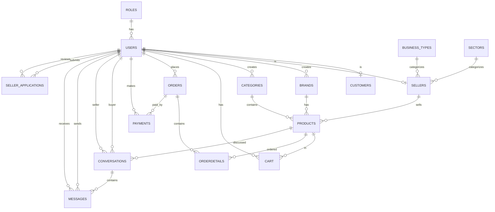

# Entity-Relationship Diagram (ERD)
## ThriftHub E-Commerce Database

---

## ASCII ERD Diagram

```
┌─────────────────────────────────────────────────────────────────────────────┐
│                           THRIFTHUB DATABASE ERD                            │
└─────────────────────────────────────────────────────────────────────────────┘

┌──────────────┐
│    ROLES     │
├──────────────┤
│ role_no (PK) │
│ role_desc    │
└──────┬───────┘
       │
       │ 1
       │
       │ N
┌──────▼──────────────────────────────────────────────────────────────────────┐
│                              USERS                                          │
├─────────────────────────────────────────────────────────────────────────────┤
│ user_id (PK)                                                                │
│ name                                                                        │
│ email (UNIQUE)                                                              │
│ password                                                                    │
│ phone_number                                                                │
│ user_role (FK → roles.role_no)                                             │
│ created_at                                                                  │
└───┬──────────────────────────────────────────────────────────────────────────┘
    │
    │ 1
    │
    ├──────────────────┬──────────────────┬──────────────────┐
    │                  │                  │                  │
    │ N                │ N                │ N                │ N
    │                  │                  │                  │
┌───▼──────┐    ┌──────▼──────┐    ┌──────▼──────┐    ┌──────▼──────┐
│CUSTOMERS │    │   SELLERS    │    │   BRANDS    │    │ CATEGORIES  │
├──────────┤    ├──────────────┤    ├─────────────┤    ├─────────────┤
│user_id   │    │ user_id (PK) │    │ brand_id    │    │ cat_id (PK) │
│(PK, FK)  │    │ shop_name    │    │ (PK)        │    │ user_id (FK)│
└──────────┘    │ type_id (FK) │    │ user_id (FK)│    │ cat_name    │
                │ sector_id(FK)│    │ brand_name  │    └──────┬──────┘
                │ store_logo   │    └─────────────┘            │
                │ store_banner │                              │
                │ description  │                              │ N
                │ verified      │                              │
                └──────┬───────┘                              │
                       │                                      │
                       │ 1                                    │
                       │                                      │
                       │ N                                    │
                ┌──────▼──────────────────────────────────────▼──────┐
                │                    PRODUCTS                        │
                ├────────────────────────────────────────────────────┤
                │ product_id (PK)                                   │
                │ product_cat (FK → categories.cat_id)              │
                │ product_brand (FK → brands.brand_id) [NULL]        │
                │ seller_id (FK → sellers.user_id) [NULL]           │
                │ product_title                                      │
                │ product_price                                      │
                │ product_desc                                       │
                │ product_image                                      │
                │ product_keywords                                   │
                │ product_condition (ENUM)                           │
                │ product_status (ENUM)                              │
                │ created_at                                         │
                └───┬───────────────────────────────────────────────┘
                    │
                    │ 1
                    │
        ┌───────────┼───────────┬──────────────┐
        │           │           │              │
        │ N         │ N         │ N            │ N
        │           │           │              │
┌───────▼──────┐ ┌──▼──────┐ ┌──▼──────────┐ ┌──▼──────────┐
│    CART     │ │ORDERS   │ │CONVERSATIONS│ │ORDERDETAILS │
├─────────────┤ ├─────────┤ ├─────────────┤ ├─────────────┤
│ cart_id(PK) │ │order_id │ │conversation_│ │orderdetail_ │
│ p_id (FK)   │ │(PK)     │ │ id (PK)     │ │ id (PK)     │
│ ip_add      │ │customer_│ │ buyer_id    │ │ order_id    │
│ c_id (FK)   │ │ id (FK) │ │ (FK)        │ │ (FK)        │
│ qty         │ │order_date│ │ seller_id   │ │ product_id  │
│ added_at    │ │order_    │ │ (FK)        │ │ (FK)        │
└─────────────┘ │ status   │ │ product_id  │ │ qty         │
                │ total_   │ │ (FK) [NULL] │ │ price       │
                │ amount   │ │ created_at  │ └─────────────┘
                └────┬─────┘ │ updated_at  │
                     │        └──────┬──────┘
                     │ 1             │
                     │               │ N
                     │               │
                ┌────▼───────────────▼──────┐
                │       PAYMENTS           │
                ├───────────────────────────┤
                │ pay_id (PK)               │
                │ amount                    │
                │ customer_id (FK)          │
                │ order_id (FK)             │
                │ currency                  │
                │ payment_method (ENUM)    │
                │ payment_status (ENUM)    │
                │ payment_date             │
                │ transaction_ref           │
                │ authorization_code        │
                │ payment_channel           │
                └───────────────────────────┘

┌─────────────────────────────────────────────────────────────────────────────┐
│                         MESSAGING SYSTEM                                    │
└─────────────────────────────────────────────────────────────────────────────┘

                ┌──────────────┐
                │CONVERSATIONS │
                ├──────────────┤
                │conversation_ │
                │ id (PK)      │
                │ buyer_id (FK)│
                │ seller_id(FK)│
                │ product_id   │
                │ (FK) [NULL]  │
                │ created_at   │
                │ updated_at   │
                └──────┬───────┘
                       │
                       │ 1
                       │
                       │ N
                ┌──────▼───────┐
                │   MESSAGES   │
                ├──────────────┤
                │ message_id   │
                │ (PK)         │
                │ conversation_│
                │ id (FK)      │
                │ sender_id    │
                │ (FK)         │
                │ receiver_id  │
                │ (FK)         │
                │ message_text │
                │ is_read      │
                │ created_at   │
                └──────────────┘

┌─────────────────────────────────────────────────────────────────────────────┐
│                      SELLER APPLICATION SYSTEM                              │
└─────────────────────────────────────────────────────────────────────────────┘

┌──────────────┐         ┌──────────────┐
│BUSINESS_TYPES│         │   SECTORS    │
├──────────────┤         ├──────────────┤
│ type_id (PK) │         │ sector_id    │
│ type_desc    │         │ (PK)         │
└──────┬───────┘         │ sector_desc  │
       │                 └──────┬───────┘
       │ 1                     │ 1
       │                       │
       │ N                     │ N
       │                       │
┌──────▼───────────────────────▼───────┐
│         SELLER_APPLICATIONS          │
├───────────────────────────────────────┤
│ application_id (PK)                  │
│ user_id (FK → users.user_id)         │
│ documentation_path                    │
│ status (ENUM: pending/approved/      │
│          rejected)                    │
│ submitted_at                          │
│ reviewed_at                           │
│ reviewed_by (FK → users.user_id)     │
└───────────────────────────────────────┘

```

---

## Relationship Summary

### One-to-Many Relationships:

1. **ROLES → USERS** (1:N)
   - One role can have many users
   - Foreign Key: `users.user_role` → `roles.role_no`

2. **USERS → CUSTOMERS** (1:1)
   - One user can be one customer
   - Foreign Key: `customers.user_id` → `users.user_id`

3. **USERS → SELLERS** (1:1)
   - One user can be one seller
   - Foreign Key: `sellers.user_id` → `users.user_id`

4. **USERS → BRANDS** (1:N)
   - One user can create many brands
   - Foreign Key: `brands.user_id` → `users.user_id`

5. **USERS → CATEGORIES** (1:N)
   - One user can create many categories
   - Foreign Key: `categories.user_id` → `users.user_id`

6. **CATEGORIES → PRODUCTS** (1:N)
   - One category can have many products
   - Foreign Key: `products.product_cat` → `categories.cat_id`

7. **BRANDS → PRODUCTS** (1:N)
   - One brand can have many products (optional)
   - Foreign Key: `products.product_brand` → `brands.brand_id` (NULL allowed)

8. **SELLERS → PRODUCTS** (1:N)
   - One seller can have many products
   - Foreign Key: `products.seller_id` → `sellers.user_id` (NULL allowed)

9. **PRODUCTS → CART** (1:N)
   - One product can be in many cart entries
   - Foreign Key: `cart.p_id` → `products.product_id`

10. **USERS → CART** (1:N)
    - One user can have many cart items
    - Foreign Key: `cart.c_id` → `users.user_id` (NULL for guests)

11. **USERS → ORDERS** (1:N)
    - One customer can have many orders
    - Foreign Key: `orders.customer_id` → `users.user_id`

12. **ORDERS → ORDERDETAILS** (1:N)
    - One order can have many order details
    - Foreign Key: `orderdetails.order_id` → `orders.order_id`

13. **PRODUCTS → ORDERDETAILS** (1:N)
    - One product can be in many order details
    - Foreign Key: `orderdetails.product_id` → `products.product_id`

14. **ORDERS → PAYMENTS** (1:N)
    - One order can have many payments (typically 1:1)
    - Foreign Key: `payments.order_id` → `orders.order_id`

15. **USERS → PAYMENTS** (1:N)
    - One customer can make many payments
    - Foreign Key: `payments.customer_id` → `users.user_id`

16. **CONVERSATIONS → MESSAGES** (1:N)
    - One conversation can have many messages
    - Foreign Key: `messages.conversation_id` → `conversations.conversation_id`

17. **USERS → CONVERSATIONS (as buyer)** (1:N)
    - One buyer can have many conversations
    - Foreign Key: `conversations.buyer_id` → `users.user_id`

18. **USERS → CONVERSATIONS (as seller)** (1:N)
    - One seller can have many conversations
    - Foreign Key: `conversations.seller_id` → `users.user_id`

19. **PRODUCTS → CONVERSATIONS** (1:N)
    - One product can have many conversations (optional)
    - Foreign Key: `conversations.product_id` → `products.product_id` (NULL allowed)

20. **BUSINESS_TYPES → SELLERS** (1:N)
    - One business type can have many sellers
    - Foreign Key: `sellers.type_id` → `business_types.type_id`

21. **SECTORS → SELLERS** (1:N)
    - One sector can have many sellers
    - Foreign Key: `sellers.sector_id` → `sectors.sector_id`

22. **USERS → SELLER_APPLICATIONS (applicant)** (1:N)
    - One user can submit many applications
    - Foreign Key: `seller_applications.user_id` → `users.user_id`

23. **USERS → SELLER_APPLICATIONS (reviewer)** (1:N)
    - One admin can review many applications
    - Foreign Key: `seller_applications.reviewed_by` → `users.user_id` (NULL allowed)

---

## Table Attributes Detail

### Core Tables

**USERS**
- Primary Key: `user_id`
- Unique: `email`
- Foreign Keys: `user_role` → `roles.role_no`
- Attributes: name, email, password, phone_number, created_at

**ROLES**
- Primary Key: `role_no`
- Attributes: role_description
- Values: 1=admin, 2=customer, 3=seller

**CUSTOMERS**
- Primary Key: `user_id` (also FK to users)
- Relationship: One-to-One with USERS

**SELLERS**
- Primary Key: `user_id` (also FK to users)
- Foreign Keys: `type_id` → `business_types.type_id`, `sector_id` → `sectors.sector_id`
- Attributes: shop_name, store_logo, store_banner, description, verified

**PRODUCTS**
- Primary Key: `product_id`
- Foreign Keys: `product_cat` → `categories.cat_id`, `product_brand` → `brands.brand_id` (NULL), `seller_id` → `sellers.user_id` (NULL)
- Attributes: product_title, product_price, product_desc, product_image, product_keywords, product_condition (ENUM), product_status (ENUM), created_at

**CATEGORIES**
- Primary Key: `cat_id`
- Foreign Keys: `user_id` → `users.user_id`
- Attributes: cat_name

**BRANDS**
- Primary Key: `brand_id`
- Foreign Keys: `user_id` → `users.user_id`
- Attributes: brand_name

### Transaction Tables

**CART**
- Primary Key: `cart_id`
- Foreign Keys: `p_id` → `products.product_id`, `c_id` → `users.user_id` (NULL for guests)
- Attributes: ip_add, qty, added_at

**ORDERS**
- Primary Key: `order_id`
- Foreign Keys: `customer_id` → `users.user_id`
- Attributes: order_date, order_status (ENUM), total_amount

**ORDERDETAILS**
- Primary Key: `orderdetail_id`
- Foreign Keys: `order_id` → `orders.order_id`, `product_id` → `products.product_id`
- Attributes: qty, price

**PAYMENTS**
- Primary Key: `pay_id`
- Foreign Keys: `customer_id` → `users.user_id`, `order_id` → `orders.order_id`
- Attributes: amount, currency, payment_method (ENUM), payment_status (ENUM), payment_date, transaction_ref, authorization_code, payment_channel

### Communication Tables

**CONVERSATIONS**
- Primary Key: `conversation_id`
- Foreign Keys: `buyer_id` → `users.user_id`, `seller_id` → `users.user_id`, `product_id` → `products.product_id` (NULL)
- Attributes: created_at, updated_at

**MESSAGES**
- Primary Key: `message_id`
- Foreign Keys: `conversation_id` → `conversations.conversation_id`, `sender_id` → `users.user_id`, `receiver_id` → `users.user_id`
- Attributes: message_text, is_read, created_at

### Supporting Tables

**SELLER_APPLICATIONS**
- Primary Key: `application_id`
- Foreign Keys: `user_id` → `users.user_id`, `reviewed_by` → `users.user_id` (NULL)
- Attributes: documentation_path, status (ENUM), submitted_at, reviewed_at

**BUSINESS_TYPES**
- Primary Key: `type_id`
- Attributes: type_description

**SECTORS**
- Primary Key: `sector_id`
- Attributes: sector_description

---

## Image ERD Diagram

The image version of the ERD can be generated using the following tools:

### Option 1: Using dbdiagram.io

Visit https://dbdiagram.io and use this code:

```dbml
Table users {
  user_id int [pk, increment]
  name varchar(100)
  email varchar(100) [unique]
  password varchar(255)
  phone_number varchar(20)
  user_role int [ref: > roles.role_no]
  created_at timestamp
}

Table roles {
  role_no int [pk]
  role_description varchar(50)
}

Table customers {
  user_id int [pk, ref: - users.user_id]
}

Table sellers {
  user_id int [pk, ref: - users.user_id]
  shop_name varchar(150)
  type_id int [ref: > business_types.type_id]
  sector_id int [ref: > sectors.sector_id]
  store_logo varchar(255)
  store_banner varchar(255)
  description text
  verified tinyint(1)
}

Table products {
  product_id int [pk, increment]
  product_cat int [ref: > categories.cat_id]
  product_brand int [ref: > brands.brand_id, null]
  seller_id int [ref: > sellers.user_id, null]
  product_title varchar(200)
  product_price decimal(10,2)
  product_desc text
  product_image varchar(255)
  product_keywords varchar(255)
  product_condition enum
  product_status enum
  created_at timestamp
}

Table categories {
  cat_id int [pk, increment]
  user_id int [ref: > users.user_id]
  cat_name varchar(100)
}

Table brands {
  brand_id int [pk, increment]
  user_id int [ref: > users.user_id]
  brand_name varchar(100)
}

Table cart {
  cart_id int [pk, increment]
  p_id int [ref: > products.product_id]
  ip_add varchar(50)
  c_id int [ref: > users.user_id, null]
  qty int
  added_at timestamp
}

Table orders {
  order_id int [pk, increment]
  customer_id int [ref: > users.user_id]
  order_date datetime
  order_status enum
  total_amount decimal(10,2)
}

Table orderdetails {
  orderdetail_id int [pk, increment]
  order_id int [ref: > orders.order_id]
  product_id int [ref: > products.product_id]
  qty int
  price decimal(10,2)
}

Table payments {
  pay_id int [pk, increment]
  amount decimal(10,2)
  customer_id int [ref: > users.user_id]
  order_id int [ref: > orders.order_id]
  currency varchar(10)
  payment_method enum
  payment_status enum
  payment_date datetime
  transaction_ref varchar(100)
  authorization_code varchar(100)
  payment_channel varchar(50)
}

Table conversations {
  conversation_id int [pk, increment]
  buyer_id int [ref: > users.user_id]
  seller_id int [ref: > users.user_id]
  product_id int [ref: > products.product_id, null]
  created_at datetime
  updated_at datetime
}

Table messages {
  message_id int [pk, increment]
  conversation_id int [ref: > conversations.conversation_id]
  sender_id int [ref: > users.user_id]
  receiver_id int [ref: > users.user_id]
  message_text text
  is_read tinyint(1)
  created_at datetime
}

Table seller_applications {
  application_id int [pk, increment]
  user_id int [ref: > users.user_id]
  documentation_path varchar(255)
  status enum
  submitted_at timestamp
  reviewed_at timestamp
  reviewed_by int [ref: > users.user_id, null]
}

Table business_types {
  type_id int [pk]
  type_description varchar(50)
}

Table sectors {
  sector_id int [pk]
  sector_description varchar(100)
}
```

### Option 2: Using MySQL Workbench

1. Open MySQL Workbench
2. Go to Database → Reverse Engineer
3. Connect to your database
4. Select the `thrifthub` database
5. Generate ERD automatically

### Option 3: Using Draw.io / diagrams.net

1. Visit https://app.diagrams.net
2. Create a new diagram
3. Use the Entity Relationship template
4. Manually create tables based on the ASCII diagram above

### Option 4: Using Mermaid (for Markdown)



---

## Cardinality Notation

- **1:1** = One-to-One (e.g., User → Customer)
- **1:N** = One-to-Many (e.g., User → Products)
- **N:M** = Many-to-Many (implemented via junction tables)

---

## Foreign Key Constraints

All foreign keys have the following constraints:
- **ON DELETE CASCADE** - Deleting parent deletes children
- **ON UPDATE CASCADE** - Updating parent updates children
- **SET NULL** - For optional relationships (e.g., product_brand, product_id in conversations)

---

**Document Version:** 1.0  
**Last Updated:** November 2025  
**Database:** ThriftHub (MariaDB 10.4.32)

